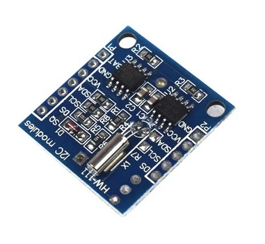
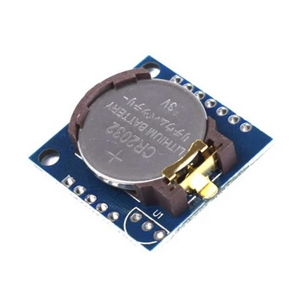
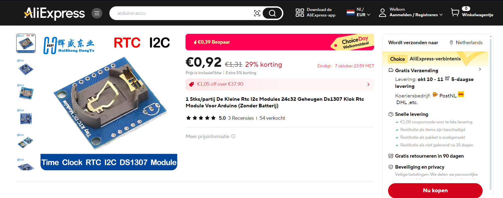

## HW111 - Real-Time Clock Module

Real-Time Clock Module




## Description
The HW111 is a real-time clock (RTC) module designed to keep track of time and date with minimal power consumption. Like other RTC modules, it maintains time even when the main system is off, thanks to a backup battery. The HW111 can interface with popular microcontrollers such as Arduino, ESP32, or Raspberry Pi via a standard I2C interface. The module is equipped with a 32.768 kHz crystal oscillator, ensuring reliable timekeeping.

### Key Features:

1. **Real-Time Clock (RTC):**
   - Tracks seconds, minutes, hours, day of the week, day, month, and year, with automatic leap-year compensation.
   - Supports both 12-hour (AM/PM) and 24-hour time formats.

2. **I2C Communication:**
   - Communicates using the I2C protocol, with the SDA (data) and SCL (clock) pins. I2C simplifies communication with microcontrollers compared to other serial interfaces.
   
3. **Backup Power Supply:**
   - The module is equipped with a CR2032 coin-cell battery slot, which keeps the clock running when the main power is off.
   
4. **Memory Storage:**
   - The HW111 offers a small amount of non-volatile RAM for storing settings or configurations that remain persistent even when power is disconnected.

5. **Low Power Operation:**
   - The RTC consumes minimal power during backup operation, extending battery life significantly.

### Pinout:

The HW111 typically features the following connections:

- **VCC:** Main power supply (typically 3.3V to 5V).
- **GND:** Ground.
- **SDA (Data):** I2C data line for communication with the microcontroller.
- **SCL (Clock):** I2C clock signal.
- **BAT:** Backup battery input for maintaining timekeeping when the main power is off.

### Advantages:

1. **Backup Battery Support:** Maintains time even when the system is powered down, making it ideal for time-critical applications.
2. **I2C Interface:** The I2C communication protocol is widely supported and easy to integrate with microcontrollers.
3. **Accurate Timekeeping:** Thanks to its crystal oscillator, the HW111 provides stable and reliable time management.
4. **Low Power:** Designed for efficient battery consumption during backup mode.

### Applications:

- **Timekeeping in Embedded Systems:** Ideal for microcontroller projects that require accurate time and date tracking.
- **Data Logging:** Adds time stamps to sensor readings or other collected data.
- **Alarms and Timers:** Can be used in alarm clocks, scheduling systems, and other time-dependent applications.
- **Portable Devices:** Suited for wearables and other portable systems where battery life is critical.
- **Home Automation:** Perfect for controlling time-based tasks, such as lighting, heating, or security systems.

### Operation Modes:

- **Read/Write Time and Date:** Use the I2C interface to read from or write to the RTC’s time and date registers.
- **Burst Mode:** Some versions allow for reading or writing all the timekeeping registers in a single operation, improving efficiency.

### Limitations:

- **Accuracy Dependent on Crystal:** Like other RTCs, the HW111’s accuracy is determined by the quality of its 32.768 kHz crystal oscillator.
- **No Temperature Compensation:** The module doesn’t have a temperature-compensated crystal, meaning its timekeeping accuracy can drift with temperature changes.

### Comparison with Other RTCs:

- **DS1307:** The DS1307 is a similar RTC module but lacks an I2C backup battery feature and is slightly less power efficient.
- **DS3231:** For more accurate applications, the DS3231 offers a temperature-compensated crystal oscillator for higher precision, but at a higher cost.

In summary, the HW111 is a cost-effective and reliable real-time clock module suitable for projects where basic timekeeping is required. Its I2C interface and backup battery functionality make it easy to integrate into microcontroller systems.

## Specs

## Order
<a href="https://nl.aliexpress.com/item/1005006301845179.html">https://nl.aliexpress.com/item/1005006301845179.html</a>


## Wiring to Raspberry Pi Pico
Todo

## Installation Libraries
Install the necessary library for HW111 RTC using the I2C interface.

```python
    HW111.py
```

## Example Code
```python
from machine import Pin, I2C
from time import sleep
from hw111 import HW111

# Initialize I2C on Raspberry Pi Pico
i2c = I2C(0, scl=Pin(1), sda=Pin(0), freq=100000)

# Initialize HW111 RTC with the I2C object
rtc = HW111(i2c)

# Set the date and time on the RTC
rtc.set_datetime(year=2024, month=12, day=31, hour=23, minute=59, second=50)

# Print the date and time in a loop
while True:
    dt = rtc.get_datetime()
    print(f"Date={dt['month']:02}/{dt['day']:02}/{dt['year']:4} Time={dt['hour']:02}:{dt['minute']:02}:{dt['second']:02}")
    sleep(1)

```
