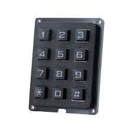
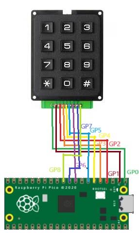

## Switch Keypad Hard




## Description
see <a href="https://learn.adafruit.com/matrix-keypad/pinouts">here </a> for pinout of the keypad

## Order
<a href="https://www.otronic.nl/nl/3x4-matrix-keypad-zwart.html">https://www.otronic.nl/nl/3x4-matrix-keypad-zwart.htm</a>


## Wiring to Raspberry Pi Pico


## Installation libraries
copy the next files to the pico
```bash
 numlock3x4.py
```

## Example code
```python
from numlock3x4 import read_key #Libary for the numlock
from utime import sleep

user_Code = []
while True: 
    key = read_key()	#reads numpad inputs
    print(key)
    sleep(.1)


```


