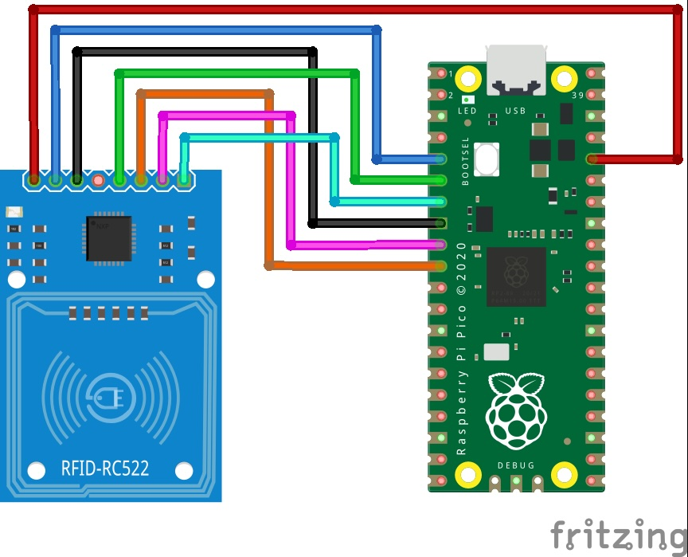

## ColorSensor (GY-31 RC522 TCS3200 )


## Where stored
Cupboard __1__ Drawer __2__  position __A3__

## Description

The **RC522** is an RFID (Radio-Frequency Identification) module designed for contactless communication, allowing devices to read from and write to RFID cards or tags. Operating at a frequency of 13.56 MHz, the RC522 can interface seamlessly with popular microcontrollers like Arduino, ESP32, and Raspberry Pi via the SPI protocol. Its integrated antenna and robust design make it a versatile tool for applications like access control, security, and identification.

## Key Features

### RFID Communication
- Operates at 13.56 MHz, compatible with most MIFARE RFID cards.
- Supports reading and writing data to RFID cards, enabling a wide range of secure data transmission tasks.

### SPI Communication
- Communicates via the SPI protocol, which uses MOSI, MISO, SCK, and CS pins, providing a straightforward and fast interface with microcontrollers.

### Low Power Consumption
- Designed to operate efficiently with minimal power, ideal for portable applications or devices with power constraints.

### Integrated Antenna
- Equipped with a built-in antenna, eliminating the need for an external one and reducing design complexity.

## Pinout
The RC522 typically features the following connections:

- **3.3V**: Main power supply.
- **GND**: Ground.
- **MISO (Master In Slave Out)**: SPI data line for incoming data.
- **MOSI (Master Out Slave In)**: SPI data line for outgoing data.
- **SCK (Clock)**: SPI clock signal.
- **SDA (CS)**: Chip select for SPI communication.
- **RST**: Reset pin for initializing the module.

## Advantages
- **Contactless Communication**: Enables seamless data transfer without direct contact.
- **Integrated Antenna**: Reduces space requirements and simplifies setup.
- **Flexible Interface Options**: SPI is widely supported across microcontroller platforms, making integration easier.

## Applications
- **Access Control Systems**: Useful for secure access points that require RFID authentication.
- **Inventory Management**: Suitable for warehouse or retail systems to track goods tagged with RFID.
- **Attendance Tracking**: Ideal for school or work attendance systems with contactless cards.

## Operation Modes
- **Read Mode**: Quickly reads data from an RFID card to verify or retrieve information.
- **Write Mode**: Can write data to compatible RFID tags for various applications.

## Limitations
- **Range Limitations**: Typically works best within a few centimeters of the tag.
- **Compatibility Constraints**: Limited to 13.56 MHz RFID tags, mainly MIFARE-type.

## Comparison with Other RFID Modules
- **MFRC522**: Similar to the RC522 but with additional support for I2C and UART interfaces.
- **PN532**: Supports NFC communication in addition to RFID, offering broader application compatibility.

## Summary
The RC522 is a cost-effective, efficient, and easy-to-use RFID module ideal for projects requiring contactless communication. Its SPI interface and low power consumption make it an accessible tool for integrating RFID technology in various systems.
## Order
<a href="https://nl.aliexpress.com/item/1005005995095290.html">https://nl.aliexpress.com/item/1005005995095290.html</a>


## Wiring to Raspberry Pi Pico


## Installation libraries
Copy next files to the Raspberry Pi Pico

```bash
RC522.py
```

## Example code
```python
from rc522 import RC522
import utime

reader = RC522(spi_id=0, sck=6, miso=4, mosi=7, cs=5, rst=3)
reader.init()

print("Bring TAG closer...")
print("")

while True:
    utime.sleep_ms(500)
    stat, tag_type = reader.request(reader.REQIDL)
    
    if stat != reader.OK:
        continue
        
    stat, uid = reader.SelectTagSN()
    if stat == reader.OK:
        card = int.from_bytes(bytes(uid), "little", False)
        print(f"CARD ID: {card}")
```
