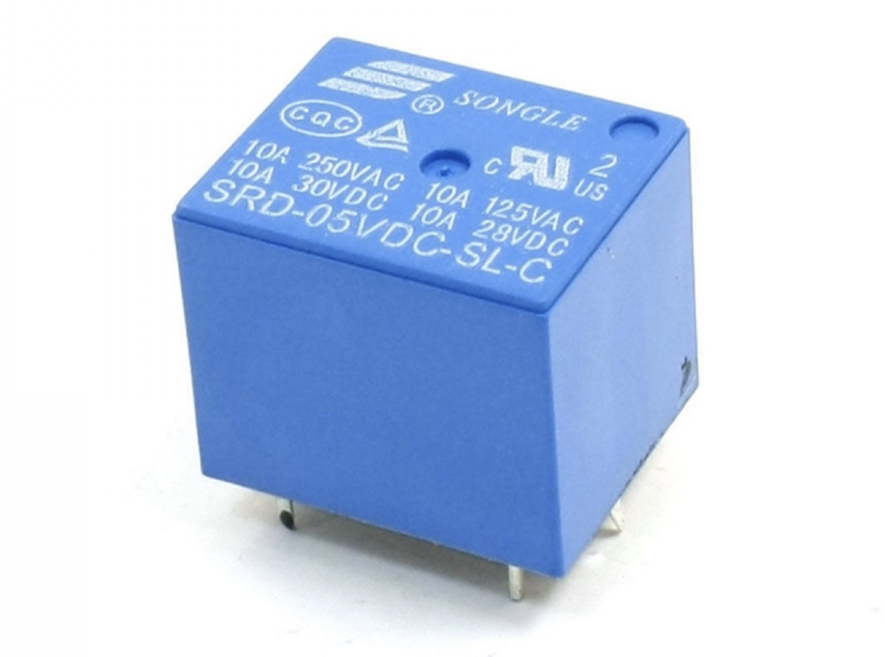
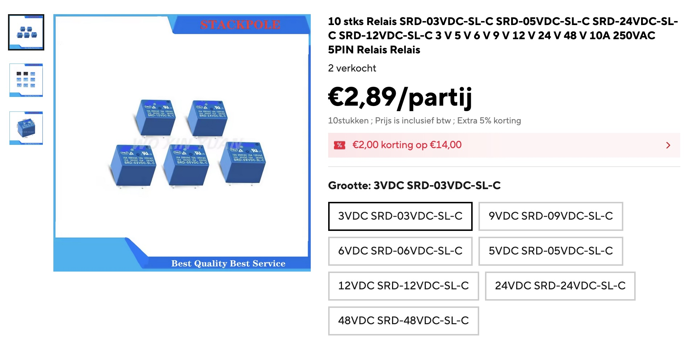
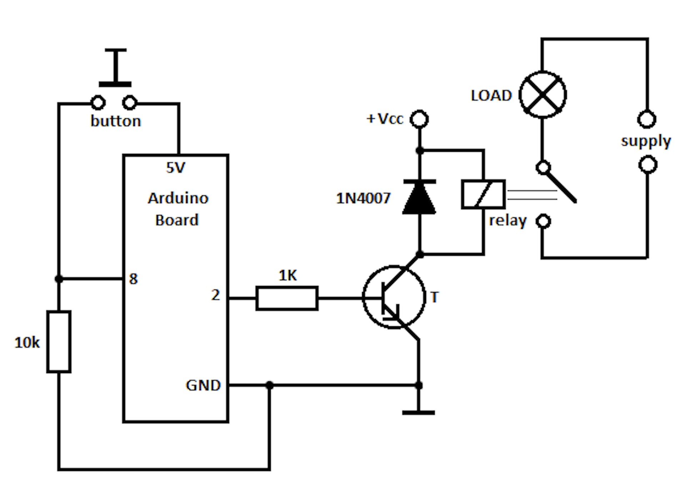
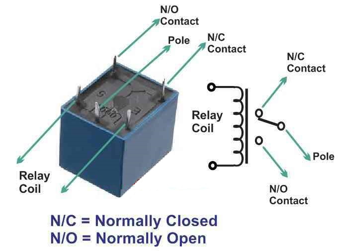

## Relais 




## Description
 Description of the SRD-03VDC-SL-C Relay
The SRD-03VDC-SL-C is an electromechanical relay commonly used to control high-voltage or high-current devices (like lamps, motors, etc.) using a low-voltage control signal (e.g., from a microcontroller).

🔍 Key Specifications

Parameter	Description
Coil Voltage	3 V DC
Operating Voltage Range	~2.25 V – 3.75 V
Coil Resistance	~70 Ω
Switching Voltage	Up to 250 VAC or 30 VDC
Switching Current	Up to 10 A
Type	SPDT (Single Pole Double Throw) – COM, NO, NC
Trigger Signal	Active LOW (on most relay boards)
Isolation	Optocoupler (on some boards) and separate power rails

This relay is typically mounted on a relay module that includes a transistor, flyback diode, and indicator LED, since the raw relay coil draws too much current for a GPIO pin.

⸻

⚙️ MicroPython Example

Below is an example for an ESP32 or Raspberry Pi Pico (W) running MicroPython, controlling an SRD-03VDC-SL-C relay via a GPIO pin.

🧠 Circuit
	•	VCC (3V3 or 5V) → Relay module VCC (check your board)
	•	GND → Relay module GND
	•	GPIO Pin (e.g., Pin 15) → Relay module IN

⚠️ If your relay module is active LOW, setting the pin LOW turns it ON, and HIGH turns it OFF.

⸻
🧰 Troubleshooting Tips
	•	If the relay doesn’t click, check that:
	•	The relay board supports 3 V logic (some need 5 V).
	•	The GND of your relay module and microcontroller are connected.
	•	The coil voltage matches (SRD-03VDC → 3 V coil; don’t confuse with SRD-05VDC, SRD-12VDC, etc.).
	•	If it’s always ON or always OFF, your module might be active HIGH instead — just invert the logic.

⸻

Would you like me to show a MicroPython example for multiple relays (e.g., 2 or 4 channels) as well?
## Order
<a href="https://nl.aliexpress.com/item/1005009826606177.html">https://nl.aliexpress.com/item/1005009826606177.html</a>



## Wiring to Raspberry Pi Pico


Geschikte transistor :
	•	BC547 (NPN, tot 100 mA) 
	•	2N2222 (NPN, tot 600 mA
Weerstand 330 Ohm

## Installation libraries
Copy next files to the Raspberry Pi Pico

```bash

```

## Example code
```python
from machine import Pin
from time import sleep

# Define the GPIO pin connected to the relay module input
relay = Pin(15, Pin.OUT)

# Active LOW relay logic
def relay_on():
    relay.value(0)   # turn ON (LOW signal)
    print("Relay ON")

def relay_off():
    relay.value(1)   # turn OFF (HIGH signal)
    print("Relay OFF")

# Initialize with relay off
relay_off()

# Test loop
while True:
    relay_on()
    sleep(2)
    relay_off()
    sleep(2)
```


