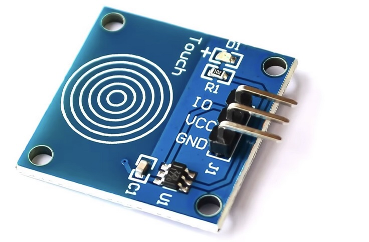
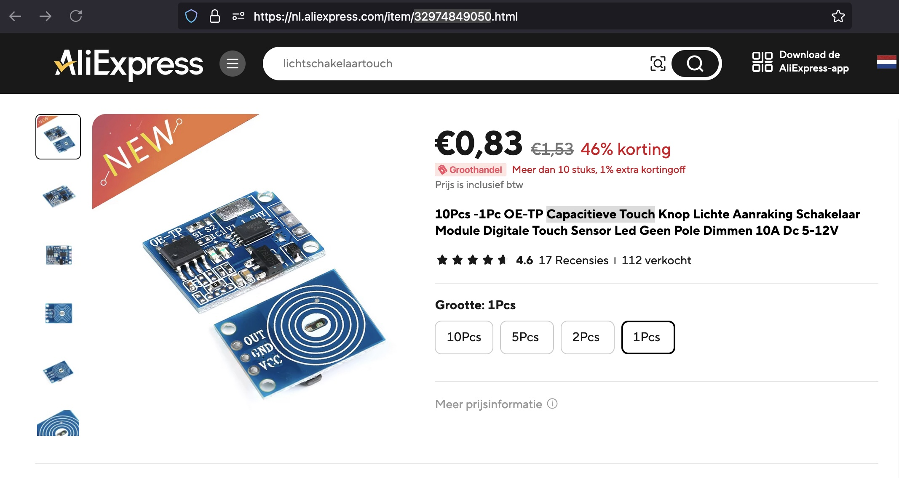

## Capacitieve Touch Button (HW139)



## Description
The HW-139 Capacitive Touch Button is a capacitive touch sensor module designed to replace traditional mechanical push buttons in various electronic applications. It uses capacitive sensing technology to detect touch, providing a more reliable and durable alternative to mechanical buttons, which can wear out over time. The HW-139 is commonly used in DIY projects, home automation, and any applications where a touch-sensitive control interface is desirable.

Key Features

	•	Capacitive Sensing Technology: Detects touch through changes in capacitance, allowing for a reliable touch input without moving parts.
	•	Compact Size: Designed for easy integration into various electronic devices and projects, making it suitable for tight spaces.
	•	Low Power Consumption: Operates on low power, making it ideal for battery-powered applications.
	•	Sensitivity Adjustment: Some modules may allow for adjustment of sensitivity to accommodate different applications and environments.
	•	LED Indicator: Often includes an onboard LED to provide visual feedback when the touch is detected.
	•	Easy Interface: Simple connection to microcontrollers, such as Arduino or Raspberry Pi, with minimal wiring required.

Specifications

	•	Operating Voltage: Typically operates at 3.3V to 5V.
	•	Touch Detection Distance: Can detect touch through a non-metallic surface (like plastic or glass) up to a few millimeters away, depending on the design and sensitivity settings.
	•	Output Type: Provides a digital output (HIGH or LOW) based on the touch state.
	•	Size: Compact and lightweight, making it suitable for portable applications.
	•	Mounting Options: Can be mounted on a PCB or used as a standalone module.

Pin Configuration

The HW-139 module generally includes the following pins:

	1.	VCC: Power supply input (3.3V to 5V).
	2.	GND: Ground connection.
	3.	OUT: Digital output pin that goes HIGH when a touch is detected and LOW when no touch is detected.

Working Principle

The HW-139 operates by measuring changes in capacitance caused by the presence of a finger near the sensor. Here’s how it works:

	1.	Capacitive Sensing: When a finger approaches the sensor, it alters the capacitance of the sensor plate. The built-in microcontroller detects this change.
	2.	Output Signal: If the change in capacitance exceeds a certain threshold, the module sends a HIGH signal on the OUT pin, indicating that a touch has been detected.
	3.	Debouncing: The module often incorporates software debouncing to ensure that the output is stable and does not fluctuate due to noise or small movements.

Applications

The HW-139 Capacitive Touch Button is suitable for a wide range of applications, including:

	1.	Home Automation: Used in light switches, appliance control, and other smart home devices.
	2.	Consumer Electronics: Integrated into gadgets and devices where touch-sensitive controls are preferred.
	3.	DIY Projects: Popular among hobbyists for use in custom electronic projects requiring touch inputs.
	4.	Industrial Equipment: Used in control panels and machinery where durable, touch-sensitive interfaces are required.
	5.	Automotive Applications: Can be implemented in car interiors for touch-sensitive controls on dashboards and infotainment systems.

Example Code for Arduino

Here’s a simple example of how to use the HW-139 with an Arduino:

```
const int touchPin = 2; // Pin connected to the OUT pin of HW-139
int touchState = 0;      // Variable to store the state of the touch button

void setup() {
  pinMode(touchPin, INPUT); // Set the touch pin as input
  Serial.begin(9600);       // Start serial communication
}

void loop() {
  // Read the state of the touch sensor
  touchState = digitalRead(touchPin);
  
  if (touchState == HIGH) {  // Touch detected
    Serial.println("Touched!");
    delay(1000);             // Wait for a second before checking again
  } else {
    Serial.println("Not touched.");
  }
  
  delay(500); // Short delay for stability
}
```

In this code:

	•	The touch sensor is connected to a digital pin, and the program reads its state.
	•	A message is printed to the Serial Monitor when the touch is detected.

Advantages

	•	Durability: No mechanical parts means reduced wear and tear, leading to a longer lifespan compared to mechanical buttons.
	•	Sealed Design: Typically resistant to dust and moisture, making it suitable for various environments.
	•	Modern Aesthetics: Provides a sleek, modern touch interface that can enhance the user experience.

Limitations

	•	Sensitivity to Environment: Can be affected by humidity, temperature, and other environmental factors, potentially leading to false triggers or reduced sensitivity.
	•	Non-Mechanical Feedback: Lack of tactile feedback can be less satisfying for users compared to mechanical buttons, which some may prefer for specific applications.
	•	Calibration Requirements: Depending on the application, the sensitivity may need to be calibrated for optimal performance.

Conclusion

The HW-139 Capacitive Touch Button module is a versatile and effective solution for touch-sensitive control in various electronic applications. Its ease of use, low power consumption, and durability make it a popular choice among hobbyists and professionals alike. Whether used in home automation, consumer electronics, or DIY projects, the HW-139 provides a reliable and modern touch interface that enhances the functionality and user experience of electronic devices.

## Order
<a href="https://nl.aliexpress.com/item/32974849050.html">https://nl.aliexpress.com/item/32974849050.html</a>


## Wiring to Raspberry Pi Pico


## Installation libraries
Copy next files to the Raspberry Pi Pico

```bash

```

## Example code

This code is not tested yet on a pico....!!!!
```python


```

## More info


