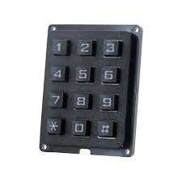
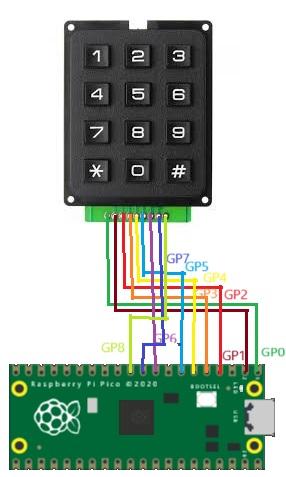

## Switch Keypad Hard




## Description

## Order
<a href="https://www.otronic.nl/nl/3x4-matrix-keypad-zwart.html">https://www.otronic.nl/nl/3x4-matrix-keypad-zwart.htm</a>


## Wiring to Raspberry Pi Pico


## Installation libraries
```bash
Copy numlock_3x4 to the Raspberry Pico
```

## Example code
```python
from numlock_3x4 import read_key		#Libary for the numlock

user_Code = []
while True: 
    key = read_key()	#reads numpad inputs
    if key != None:
        user_Code.append(key)
        if key == "#":
            print(user_Code)
            user_Code = []
```


