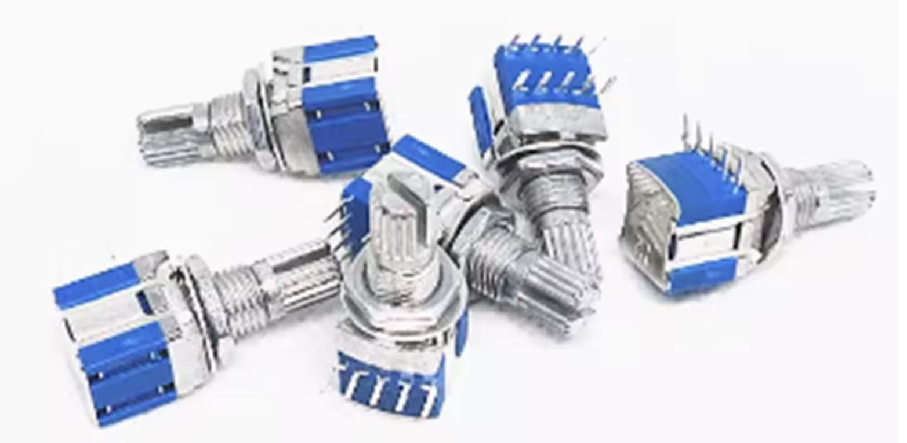
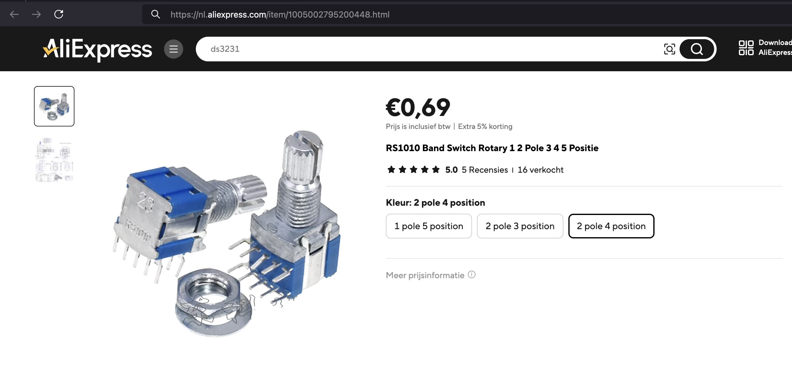

## Switch Rotery (RS1010)




## Description
The RS1010 Rotary Switch is a versatile electrical component commonly used in various electronic devices and control panels. It allows users to select one of multiple circuits or settings by rotating a knob. Rotary switches like the RS1010 are used in applications ranging from audio equipment and appliances to industrial control systems and automotive applications.

Key Features

	•	Multi-Position Selection: The RS1010 typically features multiple positions, allowing the selection of various circuit paths or settings.
	•	Mechanical Design: It has a robust mechanical design that provides tactile feedback, ensuring the user can feel each position distinctly.
	•	Durable Construction: Made from high-quality materials to ensure longevity and reliability under frequent use.
	•	Compact Size: Its small footprint makes it easy to integrate into tight spaces on control panels or within devices.
	•	Easy Installation: Usually designed for straightforward mounting, whether through panel mounting or PCB soldering.

Specifications

	•	Number of Positions: Commonly has 10 positions, allowing for various settings or circuit selections.
	•	Current Rating: Typically rated for 2A to 3A at 125V to 250V AC, depending on the model, making it suitable for low to medium power applications.
	•	Contact Configuration: Often features single or multiple poles, allowing for various configurations based on application needs.
	•	Mounting Type: Usually designed for through-hole or panel mounting, with appropriate cutout dimensions for easy installation.

Pin Configuration

The RS1010 rotary switch usually has multiple pins corresponding to each position. The specific configuration can vary, but it generally includes:

	1.	Common Pin(s): Connected to the circuit that is switched.
	2.	Output Pins: Corresponding to each switch position, connecting to different circuits or settings.

Working Principle

The RS1010 rotary switch operates by mechanically rotating a knob that aligns internal contacts with the selected position. Here’s how it works:

	1.	Knob Rotation: When the user turns the knob, a rotating contact (wiper) moves between fixed contact points corresponding to each position.
	2.	Circuit Selection: The wiper connects the common pin to the selected output pin, completing the circuit for that position.
	3.	Feedback Mechanism: Users can feel the distinct positions of the switch, providing tactile feedback that indicates which setting is currently selected.

Applications

The RS1010 rotary switch is used in various applications, including:

	1.	Audio Equipment: Adjusting volume, selecting input sources, or tuning frequencies in amplifiers and radios.
	2.	Lighting Control: Used to switch between different lighting modes or circuits in residential and commercial applications.
	3.	Industrial Controls: Implemented in machinery and control panels to select operational modes or settings.
	4.	Home Appliances: Common in devices like washing machines, microwaves, and ovens for setting different functions.
	5.	Automotive Applications: Used in dashboards for selecting different functions or settings in vehicles.

Advantages

	•	User-Friendly: Easy to use with clear tactile feedback, allowing users to select settings confidently.
	•	Versatile: Suitable for a wide range of applications across various industries.
	•	Durable: Designed to withstand repeated use, ensuring reliability in long-term applications.
	•	Compact Design: Space-efficient, making it suitable for devices with limited space.

Limitations

	•	Limited to Mechanical Use: Not suitable for applications requiring electronic or programmable control.
	•	Wear Over Time: Mechanical components may wear out over time, especially with heavy usage.
	•	Electrical Ratings: Current and voltage ratings may limit its use in high-power applications without external relays.

Conclusion

The RS1010 Rotary Switch is a reliable and versatile component that allows for easy selection between multiple circuits or settings. Its durable construction, user-friendly design, and compact size make it an ideal choice for a wide range of applications in consumer electronics, industrial controls, and home appliances. Whether used in audio equipment, lighting systems, or machinery, the RS1010 provides a practical solution for manual circuit selection, enhancing user interaction with devices.

## Order
<a href="https://nl.aliexpress.com/item/1005002795200448.html">https://nl.aliexpress.com/item/1005002795200448.htm</a>



## Wiring to Raspberry Pi Pico


## Installation libraries
Copy next files to the Raspberry Pi Pico

```bash

```

## Example code
```python


```


