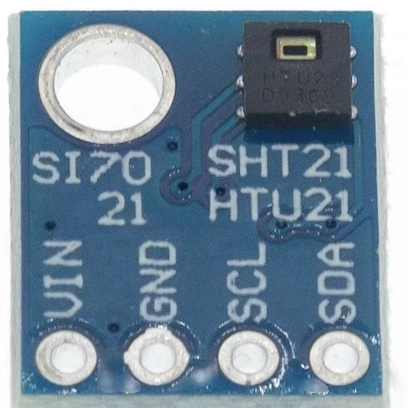

## SI7021 - Temperature Pressure Humidity sensor

## Description
The SI7021 is a digital temperature and humidity sensor designed for accurate and reliable environmental monitoring. It is widely used in various applications, including HVAC systems, weather stations, industrial automation, and consumer electronics, due to its compact size, ease of use, and high accuracy.

Key Features

	•	Measurement Parameters:
	•	Temperature: Measures ambient temperature.
	•	Humidity: Measures relative humidity.
	•	Interface: I²C interface for easy communication with microcontrollers and other devices.
	•	Operating Voltage: Typically operates between 1.9V and 3.6V, making it suitable for low-power applications.
	•	Temperature Range:
	•	Operating range: -40°C to +125°C.
	•	Accuracy: ±0.4°C within the range of 0°C to 65°C.
	•	Humidity Range:
	•	Operating range: 0% to 100% relative humidity.
	•	Accuracy: ±3% RH within the range of 20% to 80% RH.
	•	Low Power Consumption: Designed for low power consumption, making it suitable for battery-powered devices.
	•	Integrated Heating Element: Helps in maintaining sensor accuracy by reducing the effects of condensation and allowing for rapid measurements.

Specifications

	•	Temperature Measurement:
	•	Range: -40°C to +125°C
	•	Accuracy: ±0.4°C (0°C to 65°C)
	•	Humidity Measurement:
	•	Range: 0% to 100% RH
	•	Accuracy: ±3% RH (20% to 80% RH)
	•	Supply Voltage: 1.9V to 3.6V
	•	I²C Address: 0x40 (default address)
	•	Response Time: Approximately 8 seconds for humidity and 4 seconds for temperature.
	•	Dimensions: Typically, a compact package (usually in a 6-pin LGA package).

Working Principle

The SI7021 utilizes capacitive sensing technology to measure relative humidity and temperature. Here’s how it works:

	1.	Humidity Measurement:
	•	The sensor has a capacitive humidity sensor that changes its capacitance based on the humidity levels in the environment. The change in capacitance is measured and converted to a digital signal.
	2.	Temperature Measurement:
	•	The temperature is measured using a bandgap temperature sensor built into the chip, which provides an accurate temperature reading.
	3.	Digital Output:
	•	The data is processed internally and sent to the host microcontroller via the I²C interface, allowing for easy integration into various systems.

Applications

The SI7021 sensor is used in various applications, including:

	•	HVAC Systems: For monitoring and controlling heating, ventilation, and air conditioning systems.
	•	Weather Stations: To measure environmental conditions in meteorological applications.
	•	Smart Home Devices: Used in smart thermostats, humidifiers, and air quality monitors.
	•	Industrial Automation: For monitoring environmental conditions in industrial processes and storage facilities.
	•	Consumer Electronics: Incorporated into devices such as weather clocks, portable weather stations, and health monitors.

Advantages

	•	High Accuracy: Provides precise temperature and humidity measurements, suitable for various applications.
	•	Low Power Consumption: Ideal for battery-powered and low-energy devices.
	•	Compact Size: Small footprint makes it easy to integrate into various designs.
	•	I²C Interface: Simple communication protocol allows for easy integration with microcontrollers and other devices.

Limitations

	•	Limited Operating Range: The sensor operates optimally within certain temperature and humidity ranges; extreme conditions may affect accuracy.
	•	Calibration Required: While factory calibrated, some applications may require periodic calibration for precise measurements.
	•	Environmental Factors: Performance can be affected by rapid changes in temperature and humidity, particularly in high humidity or condensation conditions.

Conclusion

The SI7021 is a reliable and accurate temperature and humidity sensor that offers great performance for various applications, including environmental monitoring, HVAC, and consumer electronics. Its compact size, low power consumption, and easy I²C interface make it a popular choice for developers and engineers looking to implement accurate sensing solutions in their projects.

## Order
<a href="https://nl.aliexpress.com/item/1005006716811673.html">https://nl.aliexpress.com/item/1005006716811673.html</a>

## Wiring to Raspberry Pi Pico

## installation libraries

## 

