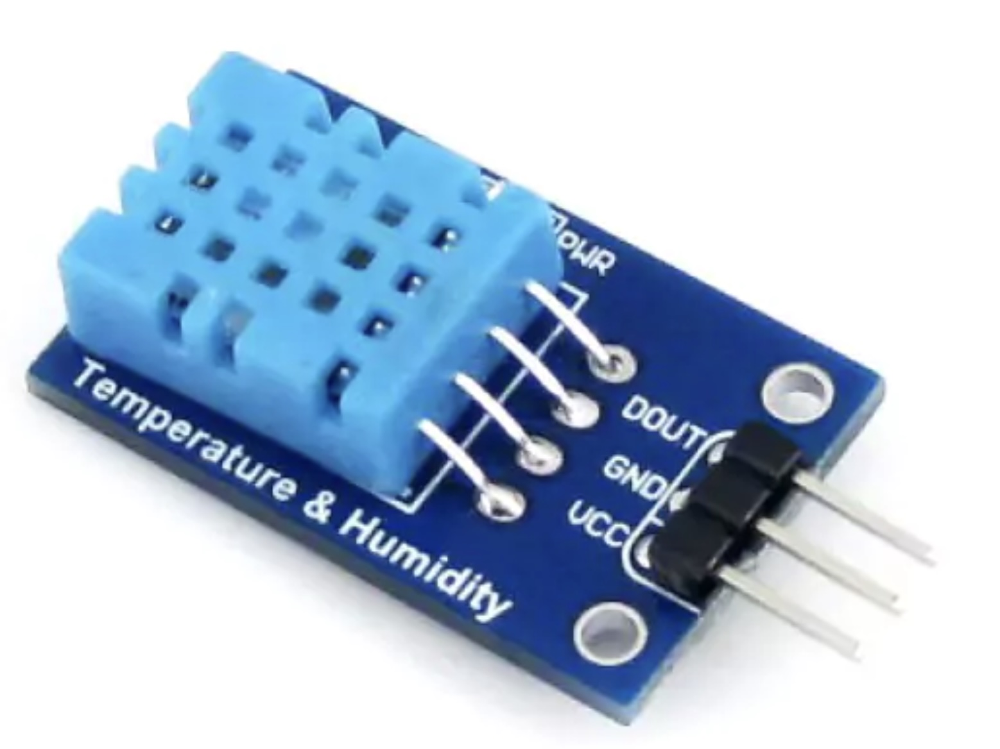
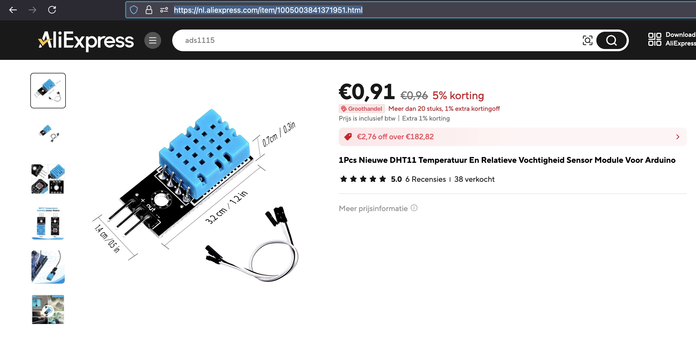
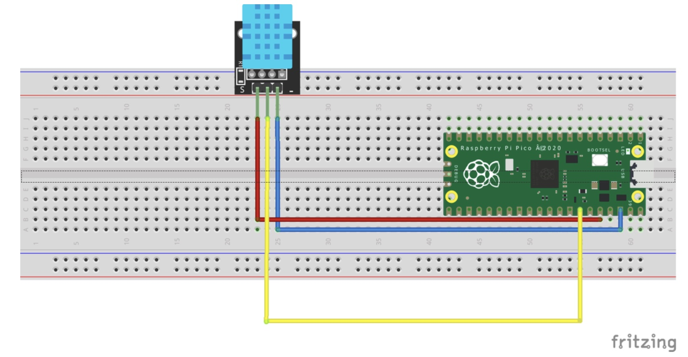

## Temperature_Humodity (DHT11)




## Description
The DHT11 is a basic, low-cost digital sensor that measures temperature and humidity. It is widely used in hobbyist and educational projects due to its simplicity, affordability, and ease of use. The sensor is designed to provide reasonably accurate readings for applications where high precision is not critical.

Key Features:

	1.	Temperature Measurement:
	•	Range: 0°C to 50°C.
	•	Accuracy: ±2°C.
	•	Provides basic ambient temperature readings, suitable for general-purpose monitoring.
	2.	Humidity Measurement:
	•	Range: 20% to 90% relative humidity (non-condensing).
	•	Accuracy: ±5% RH.
	•	Measures the moisture content in the air, useful for monitoring environmental conditions indoors.

Pinouts:

The DHT11 typically comes with 4 pins, but in some modules, it is pre-mounted on a small PCB with 3 pins, simplifying connection.

	•	VCC: Power supply (3.3V to 5V).
	•	GND: Ground.
	•	Data: Digital signal output.
	•	NC: No connection (not used).

Communication:

	•	The DHT11 communicates using a single-wire protocol, sending data to a microcontroller through the data pin. The sensor transmits the temperature and humidity values as 8-bit binary numbers, which can then be processed by a microcontroller.

Characteristics:

	1.	Low Cost: One of the cheapest temperature and humidity sensors available, making it ideal for projects on a budget.
	2.	Easy to Use: Requires minimal components to set up (usually just a pull-up resistor on the data line) and is supported by many libraries, such as those available for Arduino.
	3.	Moderate Accuracy: Sufficient for basic applications but not suitable for projects requiring high-precision measurements.
	4.	Slow Response Time: The sensor has a relatively slow response time (typically 1 reading per second), which is acceptable for applications like weather stations or simple indoor monitoring.
	5.	Pre-calibrated: The sensor is pre-calibrated, meaning users can start obtaining accurate readings immediately after connecting it to a system.

Applications:

	•	Home Automation: Monitoring temperature and humidity in smart home systems.
	•	Weather Stations: Gathering basic environmental data for DIY weather stations.
	•	HVAC Systems: Measuring room conditions to control heating, ventilation, and air conditioning systems.
	•	Greenhouse Monitoring: Maintaining proper temperature and humidity levels for plants.
	•	Educational Projects: Frequently used in teaching environments to introduce students to environmental sensors and microcontroller programming.

Comparison with DHT22:

	•	Accuracy: The DHT11 has lower accuracy and a more limited measurement range than the DHT22, which is a more advanced version of the sensor.
	•	Measurement Range: The DHT11 is limited to 0°C to 50°C for temperature and 20% to 90% for humidity, whereas the DHT22 has a wider range (-40°C to 80°C for temperature and 0% to 100% for humidity).
	•	Price: The DHT11 is cheaper but less accurate and slower than the DHT22.

Limitations:

	•	Limited Accuracy: The ±2°C and ±5% RH accuracy are acceptable for basic monitoring but not for precision applications.
	•	Narrow Measurement Range: The temperature and humidity ranges may not be suitable for extreme environmental conditions.
	•	Slow Sampling Rate: The sensor updates data at a relatively slow rate (once per second), which may not be ideal for real-time applications.

In summary, the DHT11 is a simple and affordable sensor for measuring temperature and humidity, perfect for beginners and projects where precision is not critical. It’s commonly used in DIY electronics, environmental monitoring, and home automation projects.


## specs


## Order
<a href="https://nl.aliexpress.com/item/1005003841371951.html">https://nl.aliexpress.com/item/1005003841371951.html</a>


## Wiring to Raspberry Pi Pico


## installation libraries
Copy the next class to the raspberry pico
```bash
dht.py
```

## Example code
```python
from machine import Pin, I2C
import utime as time
from dht import DHT11, InvalidChecksum

PIN_DHT = 28
pin_dht = Pin(PIN_DHT, Pin.OUT, Pin.PULL_DOWN)
sensor = DHT11(pin_dht)

while True:
    time.sleep(5)
    print(f"Temperature: {sensor.temperature}, Humidity: {sensor.humidity}")
```


