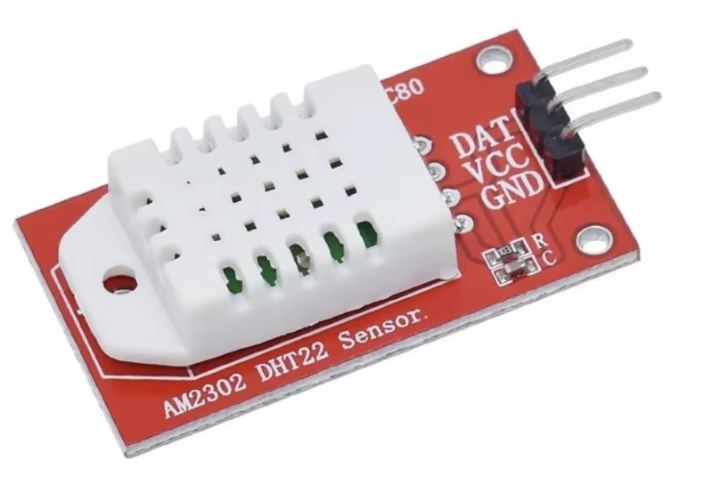
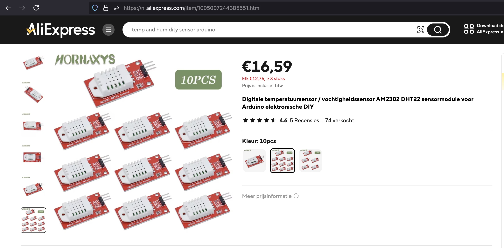
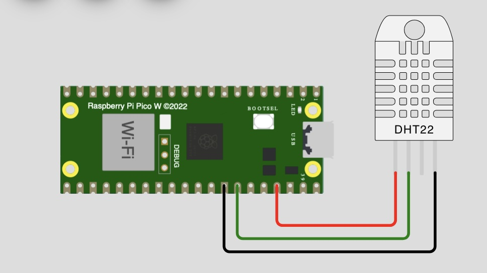

## Temperature_Humodity (DHT22)




## Description
The **DHT22** (also known as **AM2302**) is a low-cost digital sensor widely used for measuring both temperature and humidity. It offers precise and stable readings with a high level of accuracy, making it popular in various weather stations, environmental monitoring systems, and IoT projects. Here’s a breakdown of its key features:

- **Temperature Measurement**: It can measure temperatures ranging from **-40°C to 80°C**, with an accuracy of ±0.5°C.
- **Humidity Measurement**: The DHT22 measures relative humidity between **0% and 100%**, with an accuracy of ±2% (between 0% and 80% RH).
- **Digital Output**: The sensor uses a single-wire digital communication protocol, allowing easy interfacing with microcontrollers like Arduino and Raspberry Pi.
- **Slow Sampling Rate**: It updates its readings every **2 seconds**, which is slower compared to some other sensors, but adequate for many environmental applications.
- **Power Supply**: The sensor operates at **3.3V to 5V**, making it versatile for low-power systems.

The DHT22 is generally larger and more accurate than its predecessor, the DHT11, particularly in its humidity readings, making it suitable for applications requiring higher precision.


The DHT11 and DHT22 are both digital temperature and humidity sensors, but they differ in terms of accuracy, range, and cost. Here’s a comparison:

1. Temperature Measurement:

	*	DHT11:
	*	Range: 0°C to 50°C
	*	Accuracy: ±2°C
	*	Resolution: 1°C
	*	DHT22:
	*	Range: -40°C to 80°C
	*	Accuracy: ±0.5°C
	*	Resolution: 0.1°C

2. Humidity Measurement:

	*	DHT11:
	*	Range: 20-90% RH
	*	Accuracy: ±5% RH
	*	Resolution: 1% RH
	*	DHT22:
	*	Range: 0-100% RH
	*	Accuracy: ±2-5% RH
	*	Resolution: 0.1% RH

3. Sampling Rate:

	*	DHT11: Data refreshed every 1 second.
	*	DHT22: Data refreshed every 2 seconds (slower).

4. Power Supply:

	*	DHT11: 3.3V to 5.5V
	*	DHT22: 3.3V to 6V

5. Price:

	*	DHT11: Cheaper, making it more suitable for budget projects.
	*	DHT22: More expensive due to higher precision and broader range.

6. Size:

	*	DHT11: Smaller and more compact.
	*	DHT22: Slightly larger.

Summary:

	*	DHT11: Lower accuracy, smaller range, faster response, more affordable.
	*	DHT22: Higher accuracy, wider range, slower response, more expensive.

In general, the DHT22 is preferred for projects requiring better precision and wider temperature/humidity ranges, while the DHT11 is a good option for simple and low-cost applications.


## Order
<a href="https://nl.aliexpress.com/item/1005007244385551.html">https://nl.aliexpress.com/item/1005007244385551.html</a>


## Wiring to Raspberry Pi Pico


## installation libraries
Copy the next class to the raspberry pico
```bash
dht.py
```

## Example code
```python
from machine import Pin
import utime as time
from dht import DHT22

sensor = DHT22(Pin(28))

while True:
    time.sleep(5)
    print(f"Temperature: {sensor.temperature}, Humidity: {sensor.humidity}")
```


