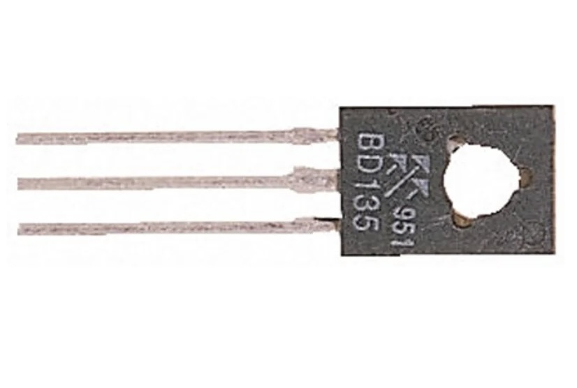

## Transistor (BD135)




## Description
The BD135 is a popular NPN bipolar junction transistor (BJT) widely used in various electronic applications, including amplification, switching, and signal processing. Known for its robustness and versatility, the BD135 is commonly found in audio amplifiers, low-frequency signal processing, and general-purpose switching applications.

Key Features

	•	Type: NPN bipolar junction transistor.
	•	Package Type: Typically available in a TO-220 or TO-92 package, making it suitable for various mounting options.
	•	Voltage Rating: Maximum collector-emitter voltage (V_CE) of up to 45V, allowing it to be used in moderately high-voltage applications.
	•	Current Rating: Maximum continuous collector current (I_C) of 1.5A, which is suitable for various medium-power applications.
	•	Gain Characteristics: DC current gain (h_FE) typically ranges from 40 to 200, depending on the specific operating conditions and model.

Specifications

	•	Collector-Emitter Voltage (V_CE): 45V
	•	Collector-Base Voltage (V_CBO): 45V
	•	Emitter-Base Voltage (V_EBO): 5V
	•	Collector Current (I_C): 1.5A
	•	DC Current Gain (h_FE): 40 to 200
	•	Power Dissipation (P_D): Up to 0.8W (depending on package and cooling conditions)
	•	Operating Temperature Range: Typically from -55°C to +150°C.

Pin Configuration

In a TO-220 package, the pin configuration for the BD135 is typically as follows:

	1.	Base (B): The control terminal, used to turn the transistor on or off.
	2.	Collector (C): The terminal through which the main current flows, connected to the load.
	3.	Emitter (E): The terminal that allows current to flow out of the transistor to ground.

Working Principle

The BD135 operates as a current amplifier or switch based on the input current applied to the base terminal. Here’s how it works:

	1.	Base Current (I_B): A small current applied to the base terminal controls a larger current flowing from the collector to the emitter.
	2.	Current Gain (h_FE): The relationship between the base current and collector current can be expressed as:

This means that a small base current can control a much larger collector current, allowing the BD135 to function as an amplifier.
	3.	Switching Action: In switching applications, when the base current exceeds a certain threshold, the transistor enters saturation mode, allowing maximum current to flow from collector to emitter. When the base current is removed, the transistor turns off, stopping the flow of current.

Applications

The BD135 is widely used in various electronic circuits, including:

	1.	Amplifiers: Employed in audio and signal amplification applications, where it enhances weak signals.
	2.	Switching Circuits: Used to control larger loads with low-power control signals, suitable for relay drivers, LED drivers, and motor controllers.
	3.	Oscillator Circuits: Commonly found in oscillator circuits for generating audio or radio frequency signals.
	4.	Regulated Power Supplies: Can be used in voltage regulation circuits to maintain stable output voltage levels.
	5.	Signal Processing: Utilized in various signal processing applications, including filters and modulator circuits.

Advantages

	•	Versatile: Suitable for a wide range of applications, making it a popular choice for hobbyists and professionals.
	•	High Current and Voltage Rating: Capable of handling moderate power loads, ideal for many electronic designs.
	•	Easy to Use: Simple integration into various circuits, with a straightforward biasing configuration.

Limitations

	•	Power Dissipation: Requires proper heat management to avoid overheating during high-power applications.
	•	Limited Frequency Response: Not suitable for high-frequency applications compared to some other transistor types (like FETs).
	•	Voltage Ratings: The maximum voltage ratings limit its use in high-voltage applications without additional components.

Conclusion

The BD135 NPN transistor is a reliable and versatile component widely used in electronics for amplification and switching applications. Its robust design, moderate power handling capabilities, and ease of use make it suitable for various circuits, from simple hobby projects to more complex electronic devices. Whether used in audio amplification, switching, or signal processing, the BD135 remains a popular choice in the electronics community.

## Order
<a href="https://nl.aliexpress.com/item/1005006160604822.html">https://nl.aliexpress.com/item/1005006160604822.htm</a>


## Wiring to Raspberry Pi Pico


## Installation libraries
Copy next files to the Raspberry Pi Pico

```bash

```

## Example code
```python


```


